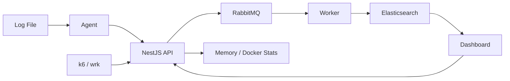

# Real-Time Log Analytics Engine

Portfolio-ready log analytics pipeline inspired by a compact ELK/Grafana architecture. A lightweight agent tails application logs, streams events to a NestJS ingestion API, buffers bursts through RabbitMQ, bulk-indexes into Elasticsearch, and renders live search/analytics in a React dashboard.


## Why This Project

This project demonstrates core data/streaming engineering skills:

- Real-time ingestion from server-side log agents.
- Backpressure using RabbitMQ before database writes.
- Elasticsearch mappings, full-text search, and aggregations.
- Worker-based bulk indexing with manual ack/nack and DLQ routing.
- Live dashboard updates with Socket.IO.
- Load testing with k6/wrk plus CPU/RAM capture.

## Architecture Diagram



## Data Flow

1. `apps/agent` tails `sample-logs/app.log` and normalizes each line into a log event.
2. The agent sends events to the API over Socket.IO.
3. The API validates each event with the shared schema and publishes it to RabbitMQ `logs.raw`.
4. RabbitMQ absorbs bursts so Elasticsearch is not hit directly by ingestion spikes.
5. `apps/worker` consumes with prefetch, batches events, and bulk-indexes into `logs-YYYY.MM.DD`.
6. Failed permanent messages are routed to `logs.dlq`; transient failures are requeued.
7. The dashboard receives live logs over Socket.IO and fetches Elasticsearch-backed analytics through REST.

## Tech Stack

| Layer | Tech | Purpose |
| --- | --- | --- |
| Agent | Node.js, TypeScript, Socket.IO client | Tail log files, retry connection, stream events |
| API | NestJS, Socket.IO, REST | Ingestion gateway, benchmark endpoint, search API |
| Queue | RabbitMQ | Durable buffering, backpressure, DLQ |
| Worker | Node.js, TypeScript, Elasticsearch client | Bulk indexing, ack/nack, retry routing |
| Search | Elasticsearch | Full-text search, filters, aggregations |
| Dashboard | React, Vite, Recharts | Live logs, charts, filters |
| Benchmark | k6, wrk, Docker stats | Throughput, latency, CPU/RAM measurement |

## Repository Layout

```text
apps/
  agent/       # file tailing + Socket.IO client
  api/         # NestJS ingestion, query, health APIs
  dashboard/   # React realtime dashboard
  shared/      # log schema + parser
  worker/      # RabbitMQ consumer + Elasticsearch bulk indexer
benchmarks/
  k6/          # ingest/search load tests
  scripts/     # run-load and resource capture scripts
infra/
  docker-compose.yml
  rabbitmq/definitions.json
sample-logs/app.log
```

## Quick Start

Install dependencies:

```bash
npm install
```

Start RabbitMQ and Elasticsearch:

```bash
docker compose -f infra/docker-compose.yml up -d
```

Run services in separate terminals:

```bash
npm run dev:api
npm run dev:worker
npm run dev:agent
npm run dev:dashboard
```

Open:

- Dashboard: http://localhost:5173
- API: http://localhost:3000
- RabbitMQ management: http://localhost:15672 (`guest` / `guest`)
- Elasticsearch: http://localhost:9200

Append a live log event:

```bash
printf '%s\n' "$(date -u +%Y-%m-%dT%H:%M:%S.000Z) INFO sample-api web-1 manual append path=/api/demo status=200 duration_ms=12" >> sample-logs/app.log
```

## Agent Defaults

```bash
LOG_FILE=./sample-logs/app.log
SERVICE_NAME=sample-api
BACKEND_WS_URL=http://localhost:3000
```

## API Endpoints

| Endpoint | Purpose |
| --- | --- |
| `GET /health` | Basic API health |
| `GET /health/memory` | API process memory, uptime, pid |
| `POST /logs/ingest` | HTTP benchmark ingestion path |
| `GET /logs/search` | Search indexed logs by time, level, service, host, text |
| `GET /analytics/logs-per-second` | Date histogram throughput chart |
| `GET /analytics/by-level` | Terms aggregation by log level |
| `GET /analytics/by-service` | Terms aggregation by service |
| Socket.IO `log` event | Realtime agent ingestion |
| Socket.IO `live-log` event | Realtime dashboard updates |

## Reliability And Backpressure

- Agent keeps a bounded retry buffer during short API disconnects.
- API never writes Elasticsearch directly during ingestion.
- RabbitMQ `logs.raw` is durable and uses persistent messages.
- Worker uses `prefetch(100)` to control indexing pressure.
- Bulk indexing acks successful items and requeues transient failures.
- Permanent mapping/validation failures route to `logs.dlq`.

## Elasticsearch Model

Daily index pattern:

```text
logs-YYYY.MM.DD
```

Core fields:

| Field | Type | Use |
| --- | --- | --- |
| `timestamp` | `date` | time filtering, histograms |
| `receivedAt` | `date` | ingestion latency checks |
| `level` | `keyword` | filters, terms aggregation |
| `service` | `keyword` | service filtering/charts |
| `host` | `keyword` | host filtering |
| `message` | `text` | full-text search |
| `message.keyword` | `keyword` | exact matching if needed |
| `metadata` | `object` | request IDs, status codes, durations |

## Benchmarking

Install tools:

```bash
brew install k6 wrk
```

Start infra and services first:

```bash
docker compose -f infra/docker-compose.yml up -d
npm run dev:api
npm run dev:worker
npm run dev:dashboard
```

Run full benchmark flow:

```bash
API_URL=http://localhost:3000 VUS=20 DURATION=1m BATCH_SIZE=10 ./benchmarks/scripts/run-load.sh
```

Run only ingest load:

```bash
API_URL=http://localhost:3000 VUS=50 DURATION=2m BATCH_SIZE=20 k6 run benchmarks/k6/ingest-http.js
```

Run only query load:

```bash
API_URL=http://localhost:3000 VUS=20 DURATION=2m k6 run benchmarks/k6/search.js
```

Capture resource usage manually:

```bash
API_URL=http://localhost:3000 ./benchmarks/scripts/collect-stats.sh
```

Optional REST pressure with `wrk`:

```bash
wrk -t4 -c64 -d30s 'http://localhost:3000/analytics/by-level'
```

Reports are written to `benchmarks/reports/`:

- `k6-ingest-*.json`: ingest throughput, p95 latency, error rate.
- `k6-search-*.json`: search/analytics latency and failures.
- `docker-stats-*.txt`: container CPU/RAM snapshots.
- `api-memory-*.json`: API `rss`, `heapUsed`, `heapTotal`, `external`, `arrayBuffers`.

## Verification

```bash
npm run build
npm test
docker compose -f infra/docker-compose.yml config
```

## Security / Maintenance Notes

- `npm audit --audit-level=moderate` reports moderate advisories in current dependencies.
- Some fixes may require major upgrades; no forced upgrade is applied by default.
